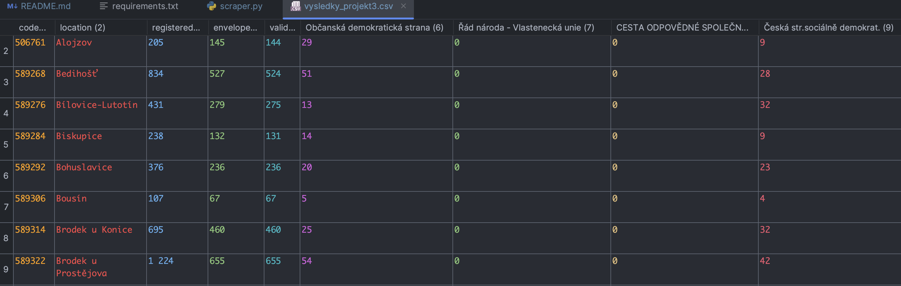

# Election scraper - Volby 2017

K čemu je užitečný:

- stažení volebních dat dle zadaného územního celku
- stažení volebních jednotlivých okrsků obsažených v územním celku
- extrakce údajů o účastnících, počtech validích hlasů, hlasů dle jednotlivých volebních stran apod.
- zápis těchto dat do tabulkového formátu a jejich export do .csv

## Instalace

Nejdříve je vhodné si vytvořit virtuální prostředí.
Všechny potřebné balíčky lze nainstalovat pomocí přiložené specifikace.
Pro tento účel lze použít:
> "pip install -r requirements.txt"

## Spuštění scriptu

Ke spuštění scriptu jsou nutné dva parametry. Bez těchto parametrů bude program ukončen.
Prvním parametrem je odkaz na webovou stránku, druhým je pak jméno výstupního souboru s daty.

Příklad spuštění zadáním do terminálu:

> python3 scraper.py "https://volby.cz/pls/ps2017nss/ps32?xjazyk=CZ&xkraj=12&xnumnuts=7103" "vysledky_projekt3.csv"

Vybraný územní celek reprezentuje odkaz vložený do prvního parametru, kde výstup do našeho souboru je v parametru
druhém.

### Ukázka výsledného výstupu

